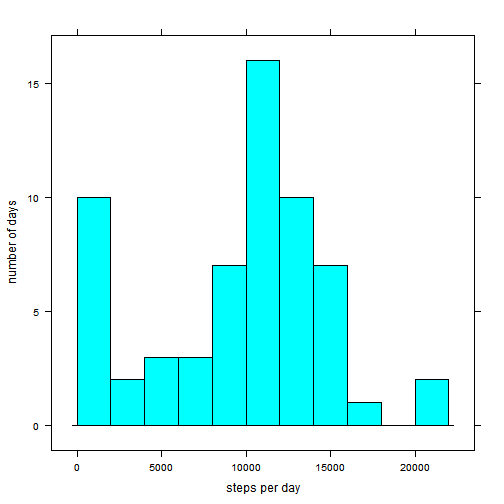
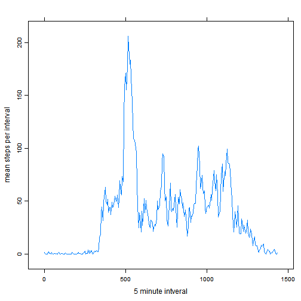
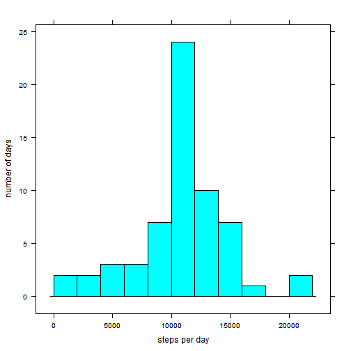
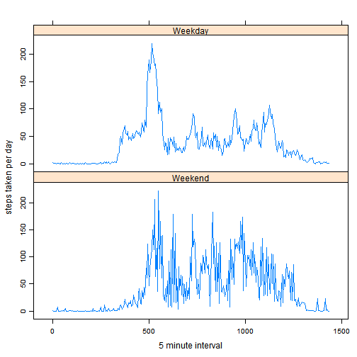

#Reproducible Research Assignment 1 (Activity Measures)

---
author: "Max Guthier"
date: "August 16, 2015"
---

##Background
This assignment is part of the Coursera tenure track in Data Science. It makes use of data from a personal activity monitoring device. This device collects data at 5 minute intervals through out the day. The data consists of two months of data from an anonymous individual collected during the months of October and November, 2012 and include the number of steps taken in 5 minute intervals each day.

##Variables
The raw dataet includes the following variables
*steps: Number of steps taking in a 5-minute interval (missing values are coded as NA)
*date: The date on which the measurement was taken in YYYY-MM-DD format
*interval: Identifier for the 5-minute interval in which measurement was taken

##Obtain Raw Data
This downloads the raw data file from the source website and loads it to R.

```r
setInternet2(use = TRUE)
fileURL<-"https://d396qusza40orc.cloudfront.net/repdata%2Fdata%2Factivity.zip"
download.file(fileURL,"activity.zip")
library(utils)
unzip("activity.zip")
raw<-read.csv("activity.csv")
```

##Daily Steps Taken
This creates a histogram (using the lattice package) with the number of steps taken per day for the 61 days in the dataset. Note that intervals with missing values are ignored, causing a number of days with missing data to be treated as having zero steps.

```r
totalsteps<-tapply(raw$steps,raw$date,sum, na.rm=TRUE)
library(lattice)
histogram(totalsteps,type="count",xlab="steps per day",
          ylab="number of days",breaks=seq(from=0,to=22000,by=2000))
```

 

Following the same logic (ignoring missing values), we can calculate the central distribution values for daily steps taken.

```r
mean(totalsteps)
```

```
## [1] 9354.23
```

```r
median(totalsteps)
```

```
## [1] 10395
```

##Daily Activity Pattern
This calculates the mean steps taken in each 5 minute interval (ignoring missing values) and creates a time series plot of them.

```r
meansteps<-tapply(raw$steps,raw$interval,mean, na.rm=TRUE)
tsmeansteps<-ts(meansteps,start=0,frequency=1/5)
xyplot(tsmeansteps,xlab="5 minute intveral",ylab="mean steps per interval")
```

 

This identifies the 5-minute interval (top row) in which on average the most steps were taken (bottom row). If there are multiple intervals with the same average number of steps taken, the first is displayed.

```r
which.max(tsmeansteps)
```

```
## 835 
## 104
```

##Imputing Missing Values
Assuming zero steps taken in each interval with missing data is a major source of bias. As activity follows a pronounced pattern throughout the day, it seems most prudent to take the mean for the respective interval as the best estimator for missing data in any given interval.
This calculates the number of missing values in the dataset that need to  be replaced

```r
sum(is.na(raw[,1]))
```

```
## [1] 2304
```

This adds a vector with the mean number of steps taken per interval that were calculated in the previous step, then uses it to replace all missing values. To avoid ambiguity, a copy of the original data set (the "clean" data set) is first created within which the operation takes place.

```r
clean<-raw
clean$est<-meansteps
for (i in 1:17568)
        {if (is.na(clean[i,1])==1)
                {clean[i,1]<-clean[i,4]}
        }
```

##Daily Steps Taken (missing data filled in)
This creates a histogram of the daily steps taken with the missing data filled in. Several of the outliers to the left have been shifted to the center in the process.

```r
meanstepsnoNA<-tapply(clean$steps,clean$date,sum, na.rm=TRUE)
histogram(meanstepsnoNA,type="count",xlab="steps per day",
          ylab="number of days",breaks=seq(from=0,to=22000,by=2000))
```

 

Creating estimates for missing values also affected the mean and median values of daily steps taken. These metrics have increased and are, in fact, identical because of several days that only consisted of missing values and now each carry the mean value.

```r
mean(meanstepsnoNA)
```

```
## [1] 10766.19
```

```r
median(meanstepsnoNA)
```

```
## [1] 10766.19
```

##Daily Activity Pattern on Weekdays/Weekends
This section separates activity pattern by weekday and weekend. First, the day of week is looked up and the dataset split on the variable

```r
clean$weekday<-as.Date(clean$date)
clean$weekday<-weekdays(clean$weekday)
Weekday<-clean[clean$weekday!=c("Saturday","Sunday"),]
Weekend<-clean[clean$weekday==c("Saturday","Sunday"),]
```

Next, the mean steps taken per interval are transformed into time series for weekday and weekend respectively.

```r
Weekday<-tapply(Weekday$steps,Weekday$interval,mean)
Weekend<-tapply(Weekend$steps,Weekend$interval,mean)
Weekday<-ts(Weekday,start=0,frequency=1/5)
Weekend<-ts(Weekend,start=0,frequency=1/5)
```

Finally, the time series are combined in one panel plot.

```r
Panel<-cbind(Weekday,Weekend)
xyplot(Panel,xlab="5 minute interval",ylab="steps taken per day")
```

 

The daily activity pattern looks much more erratic on weekends which may be caused by the smaller sample of weekend days making the curve not be as smooth.
